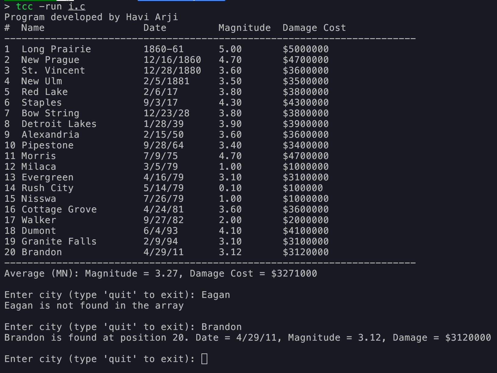

# Minnesota Earthquakes (C)

Small C program that lists 20 Minnesota earthquakes and lets you search by city.

- **Columns:** Sequence, Name, Date, Magnitude, Damage Cost  
- **Damage Cost:** `Magnitude × 1,000,000`  
- **Averages:** Prints mean magnitude and average damage cost below the table  
- **Search Loop:** Prompts repeatedly until you type `quit`  
- **Note:** Exact city match (case-sensitive) using the original `compare()`; only `<stdio.h>` is used.

## Screenshot


## Build
```bash
gcc -o earthquakes main.c
