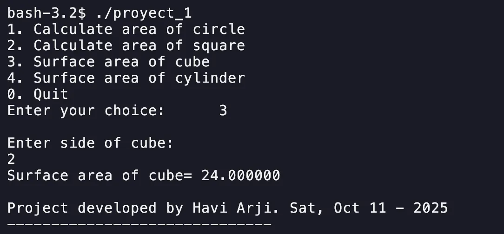
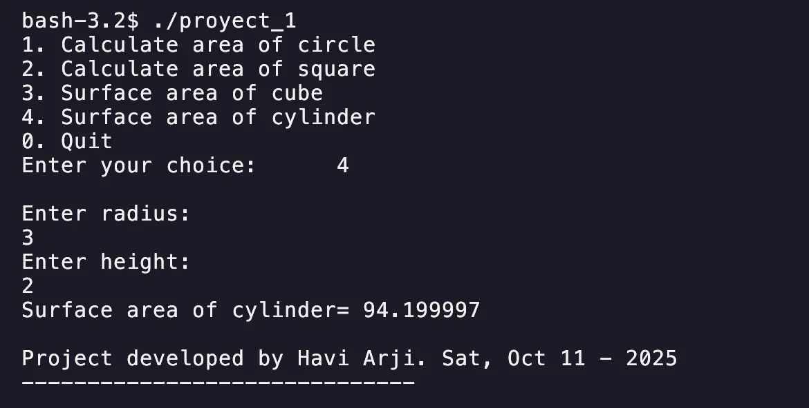

# Project 2 – Adding calculations to an existing C Program

## Introduction
This project is a simple C program that calculates different geometric areas. It allows users to choose from multiple shapes using a menu-driven interface. Each option performs the corresponding mathematical formula and displays the result.

## Screenshots



## Code
```c
case 3: {
    printf("\nEnter side of cube:\n");
    num = input();
    result = 6 * (num * num);
    printf("Surface area of cube = ");
    output(result);
    break;
}

case 4: {
    float r, h;
    printf("\nEnter radius:\n");
    r = input();
    printf("Enter height:\n");
    h = input();
    result = 2 * 3.14 * r * (h + r);
    printf("Surface area of cylinder = ");
    output(result);
    break;
}
```

## Resources
The code, binaries, and documentation can be found on [GitHub](https://github.com/4rji/C-Programming/tree/main/project-2).
