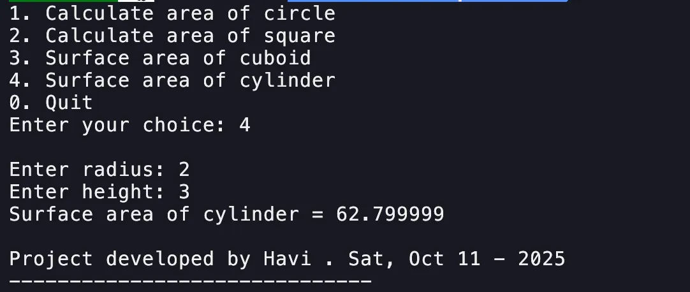

# Project 2 – Adding calculations to an existing C Program

## Introduction
This project is a simple C program that calculates different geometric areas. It allows users to choose from multiple shapes using a menu-driven interface. Each option performs the corresponding mathematical formula and displays the result.

## Screenshots



## Code
```c
            case 3: {
                float l, w, h;
                printf("\nEnter length: ");
                l = input();
                printf("Enter width: ");
                w = input();
                printf("Enter height: ");
                h = input();
                result = 2 * (l*h + l*w + h*w);
                printf("Surface area of cuboid = ");
                output(result);
                break;
            }
            case 4: {
                float r, h;
                printf("\nEnter radius: ");
                r = input();
                printf("Enter height: ");
                h = input();
                result = 2 * 3.14 * r * (h + r);
                printf("Surface area of cylinder = ");
                output(result);
                break;
            }
```

## Resources
The code, binaries, and documentation can be found on [GitHub](https://github.com/4rji/C-Programming/tree/main/project-2).
