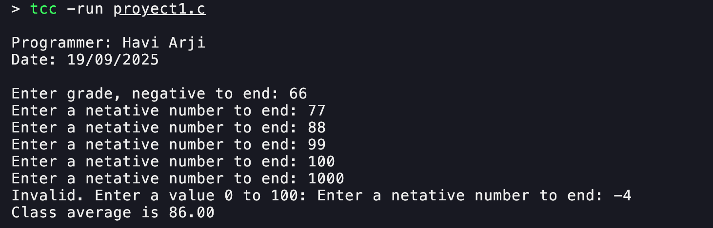
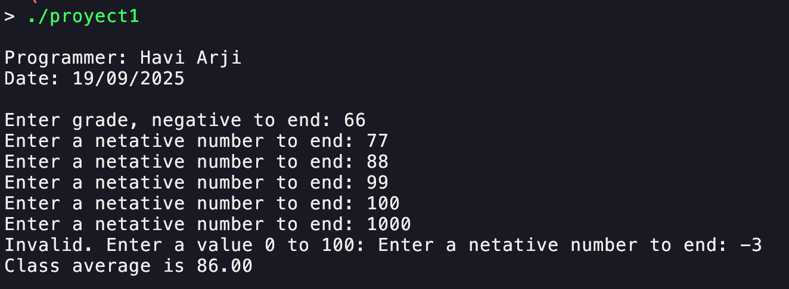

# Proyect1 – Enhanced C Input Validation

## Introduction
The first project is about using an existing C program and enhancing it with additional features. The current program terminates after `input = -1`, but users will be allowed to enter any negative integer value in the future. In addition, input is restricted to values between 0 and 100. Finally, we generate portable binaries for both ARM and AMD architectures.

## Binaries
- `proyect1`: AMD64 build
- `proyect1-arm`: ARM build

## Screenshots



## General Comments
```c
while (grade >= 0) {
    if (grade <= 100) {
        total = total + grade;      // add grade to total
        counter = counter + 1;      // increment counter
    } else {
        printf("Invalid. Enter a value 0 to 100: ");
        scanf("%d", &grade);
    }
}
```

## Notes
1. Enhanced C code with input validation is available in `proyect1.c`.
2. Documentation (`proyect1.pdf`) and binaries live alongside the source in this folder.

## Author
Havi Arji
